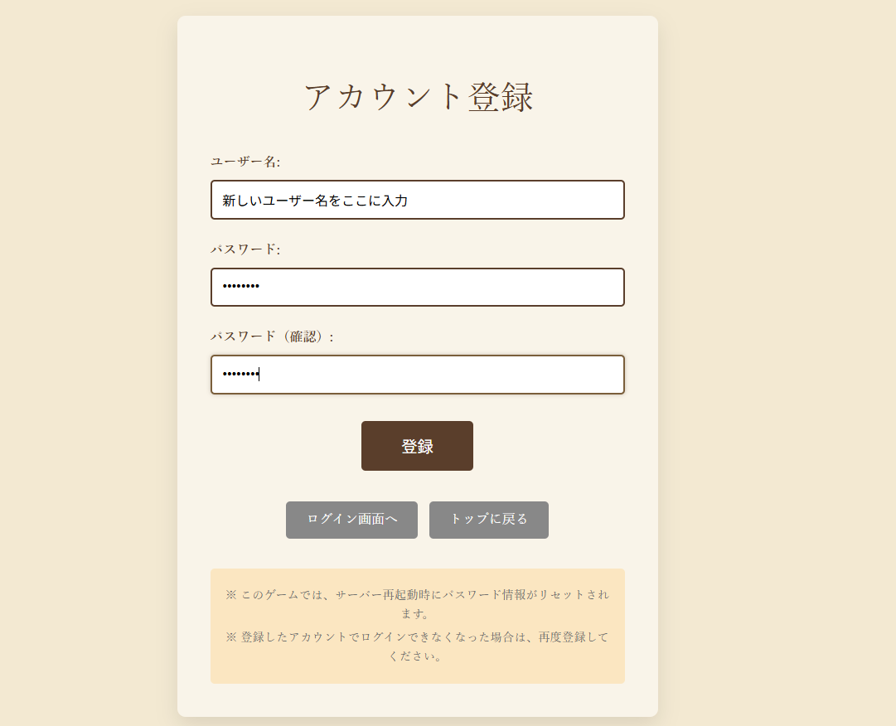
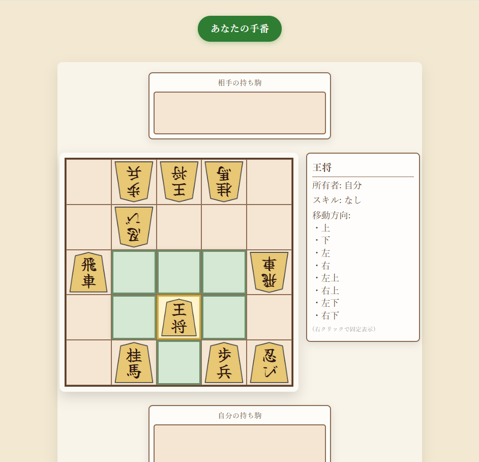
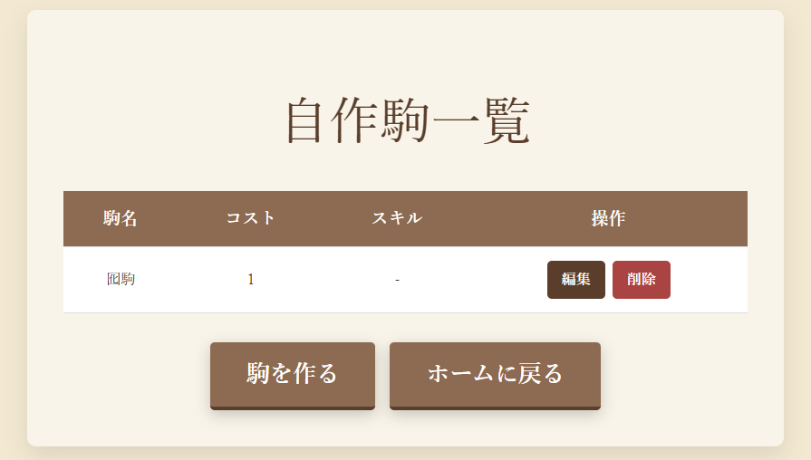
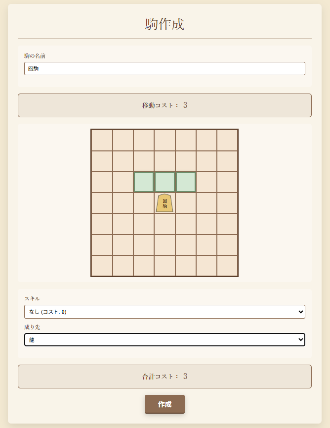

# 創棋
## 🔎「創棋」とは
将棋をベースにしたオンライン対戦型のボードゲームです。
## 🎮遊び方
このゲームは基本的にマニュアルが必要な部分はありません。画面のボタンを押していくだけで遊ぶことができます。ゲームプレイ中にわからないことがある時に本マニュアルを使用してください

### 👤アカウントを作る
#### 新規アカウントを作成する方法を説明します
1. ゲームのトップ画面に移動します
2. トップ画面から「新規登録」をクリックします
3. 新規の{ユーザー名}{パスワード}{パスワードの再入力}を埋めます
4. 「登録」ボタンでアカウントを作成できます

#### 既存アカウントでログインする方法を説明します
1. ログイン画面に移動します
2. アカウントの{Username}、{Password}を入力します
3. 「Sgn in」ボタンでログインします
4. ホーム画面に移動すると成功です
### ⚔️対戦する
#### 対戦を始める方法を説明します
**このゲームは二人用です**

- 対戦を作成する側（後攻）をプレイヤ１（①）
- 対戦に参加する側（先攻）をプレイヤ２（②）

として説明します
1. ①,②ともにホーム画面に移動します
2. ①,②ともに「対局開始」ボタンからマッチング画面に移動します
3. ①は「ルームの作成」ボタンから対戦する部屋を作成します
4. ②の画面の{ルーム一覧}から①のユーザー名を探し、「対戦リクエスト」ボタンからリクエストを送信します
5. ①の画面に対戦リクエストが表示されるため「承認する」をクリックして対戦を始めます
6. ①,②ともにゲーム画面に移動すると対局が開始されます

#### ゲームのルール一覧
将棋的な基本ルール
- 駒は交互に動かします
- 駒はその駒が持っている**移動ルール**に従って動くことができます
- 自分の駒を相手の駒に重ねることで相手の駒を**取る**ことができます
  - 取った相手の駒は自分の**持ち駒**に移動されます
  - 持ち駒の駒は自分の番に盤上に配置することができます

ゲーム特有のルール（将棋とは異なるルール）
- 相手の陣の**奥1段**に移動すると駒は**成る**ことができます
  - 成ることで移動ルールが変わります
- 持ち駒からの配置は盤上の相手の駒が無い好きな場所に配置できます（二歩等の制限はありません）
- 駒は特殊な**スキル**を持っていることがあります
- 相手の「王将」と書かれた駒を全て取ることで**勝利**できます

#### ゲームで遊ぶ方法を説明します
ゲーム画面の操作方法
- 画面上部に「あなたの手番です」と緑色で表示されている時が自分の手番です
- 画面上部に「相手の手番です」と茶色で表示されている時は相手の手番です

自分の手番での操作

1. 駒は自分の手番の時に操作することができます
2. 移動させたい駒を左クリックします
3. 緑色で表示されているマスが移動可能なマスです
4. 緑色のマスを左クリックすることで駒を移動させることができます

共通の操作

1. 駒にマウスを重ねることで駒の詳細を見ることができます
2. 駒にマウスを重ねた状態で右クリックすることで詳細を表示したまま固定できます
3. 再度駒の上で右クリックすることで固定を解除できます

### 🀄駒を創る
#### 自作の駒を創る方法を説明します

1. ホーム画面から「自作駒一覧」ボタンから駒一覧画面に移動できます
2. 駒一覧画面には自作した駒の一覧が表示されます
3. 駒の「編集」や「削除」を行うことができます。

4. 「駒を作る」ボタンから駒作成画面に移動します
5. {駒の名前}からその駒が盤上に配置される時の駒名を指定します
6. {画面中央の盤}で移動させたいマスをクリックすることで、その駒が持つ移動ルールを編集します
7. {スキル}からその駒が持つスキルを決めます
8. {成り先}からその駒が相手の陣地に到達した時に成る駒を指定します
9. 合計コストに表示されている値がその駒が持つコストです
10. 「作成」ボタンで作った駒を登録することができます

#### スキル一覧
- 「STEALTH」コスト5
  - 駒の動きが一ターン遅れて相手の画面に反映される
  - 移動先に駒があった場合は即時に駒取る
    - その場合は相手の画面上では取られた駒が消える
  - 移動後に相手が移動先に駒を置いた場合、駒は取られる
- 「COPY」コスト4
  - 取った駒の動きをコピーする
  - 駒を取るたびに移動ルールが変更される

### 🎴デッキを創る
- ホーム画面から「デッキ一覧」ボタンをクリックすることでデッキ一覧画面に移動できる
- デッキ一覧画面では、使用できるデッキの一覧が表示されます
  - 「選択」ボタンから次の対局で使用するデッキを選択することができます
  - デッキの「編集」や「削除」を行うことができます
- 「デッキ作成」ボタンからデッキ作成画面に移動することができます
- デッキ作成画面ではデッキの作成を行うことができます
  - {駒を選択}から配置したい駒を選ぶ
  - 画面中央の盤をクリックすることで選択した駒を配置することができる
  - 配置する駒のコストの合計がデッキのコストになる
  - **デッキのコストは50以下**である必要がある
  - {デッキ名}からデッキの名前を決める
  - 「デッキを保存」ボタンからデッキを保存する
